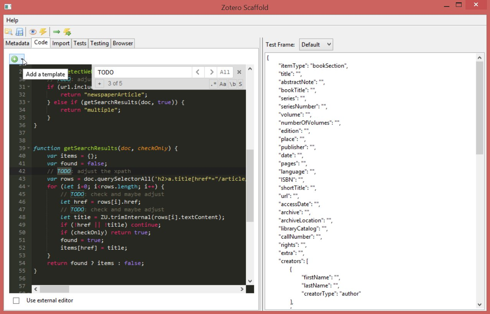

Scaffold is an integrated development environment for creating
[Zotero](https://www.zotero.org/) [translators](https://github.com/zotero/translators/).

## Installation

To install the extension:
* Download the `xpi` file of the [latest release](https://github.com/zotero/scaffold/releases)
* In Zotero, click `Tools → Add-Ons`, then drag the `.xpi` for the plugin onto the Add-Ons window that opens. 

## Build and release

To build the extension, enter this directory and run build.sh:

    ./build.sh [VERSION]

This will create a scaffold.xpi file, which you can add as an add-on in Zotero. (This is basically just a ZIP of the `src` directory.)

For releasing a new version, use this command:

    ./release VERSION

## Development

Create a text file containing the full path to the `src` directory,
name the file `scaffold@zotero.org`, and place it in the `extensions`
directory of the [Zotero profile directory](https://www.zotero.org/support/kb/profile_directory).
Restart Zotero to try the latest code changes.

## LICENSE

Scaffold is part of the [Zotero](https://www.zotero.org), produced by the Roy Rosenzweig Center
for History and New Media at George Mason University, and is licensed under
the [GNU Affero General Public License version 3](https://www.gnu.org/licenses/agpl-3.0.en.html).

Additional Tools:
* the Ajax.org Cloud9 Editor [ACE](https://ace.c9.io/),
licensed under the Mozilla Tri-License (MPL, GPL, LGPL)
* icons from the [FamFamFam Silk icon set](http://www.famfamfam.com/lab/icons/silk/), licensed under Creative Commons Attribution 2.5
